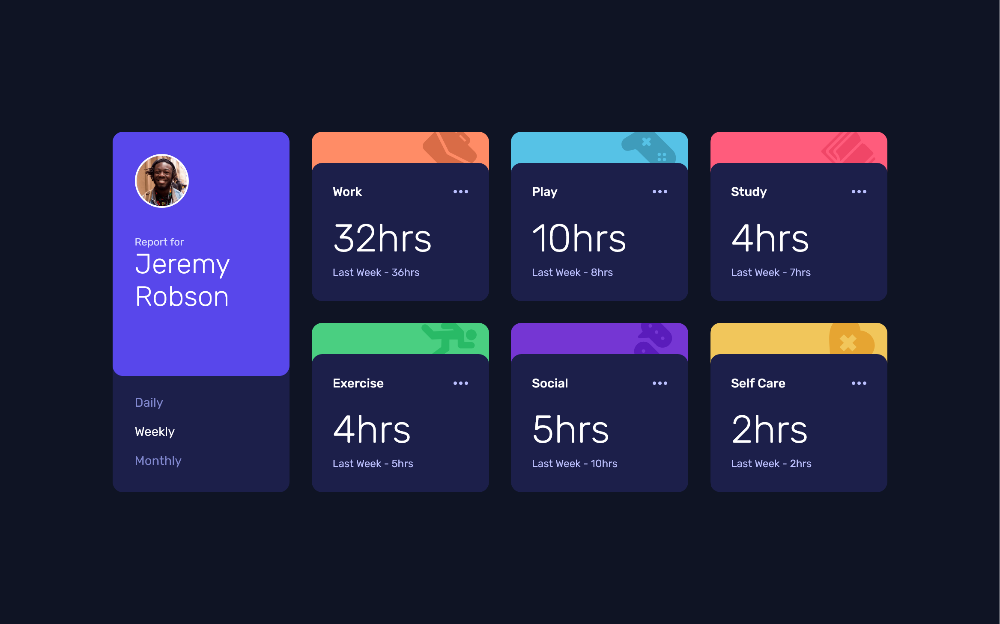

# Frontend Mentor - Time tracking dashboard solution

This is a solution to the [Time tracking dashboard challenge on Frontend Mentor](https://www.frontendmentor.io/challenges/time-tracking-dashboard-UIQ7167Jw). Frontend Mentor challenges help you improve your coding skills by building realistic projects. 

## Table of contents

- [Overview](#overview)
  - [Screenshot](#screenshot)
  - [Links](#links)
- [My process](#my-process)
  - [Built with](#built-with)
- [Author](#author)
- [License](#License)

## Overview

### Screenshot

### Links

- [Solution](https://www.frontendmentor.io/)
- [Live Site](https://)

## My process

### Built with

- Mobile-first workflow
- Semantic HTML5 markup
- Accessibility (A11y)
- BEM methodology
- Responsive fluid layout
- Flexbox
- Grid
- TypeScript
- [Sass](https://sass-lang.com/) - SCSS for maintainable and modular styles
- [Vite](https://vite.dev/) - Build tool for modern web development
- [Vercel](https://vercel.com/) - Hosting and deployment platform

## Author

- Frontend Mentor - [@DocForLoop](https://www.frontendmentor.io/profile/DocForLoop)

## License

This project is licensed under the MIT License - see the [LICENSE](./LICENSE) file for details.